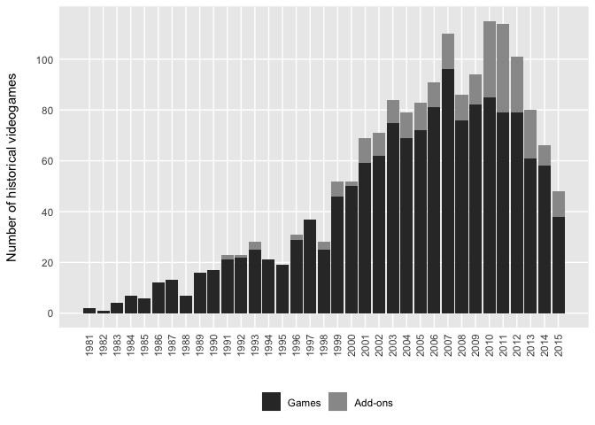
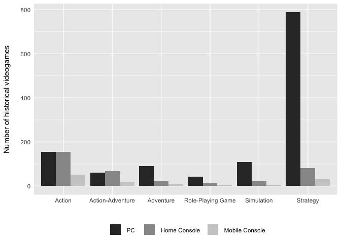
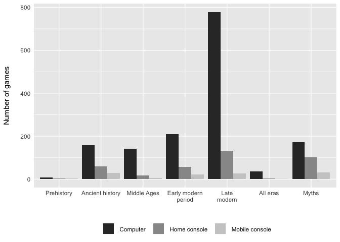
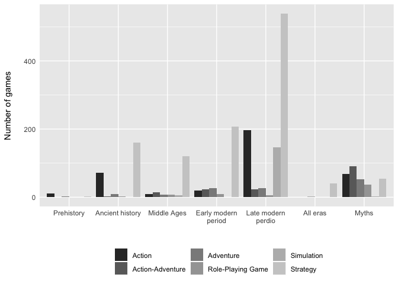

R Notebook
================

We load some packages useful for our analysis.

``` r
library(reshape2)
library(ggplot2)
library(stringr)
library(xtable)
library(plyr)
library(dplyr)
library(readr)
library(gridExtra)
```

Importation
-----------

We import the data. The first column is duplicated. We delete it.

``` r
data <- read_csv("data.csv")
data <- data[,-1]
```

What are the variables in the database?
---------------------------------------

``` r
str(data)
```

    ## Classes 'tbl_df', 'tbl' and 'data.frame':    4790 obs. of  10 variables:
    ##  $ ID      : int  1 1 3 3 3 3 4 5 6 7 ...
    ##  $ name    : chr  "1066" "1066" "12 O'Clock High : Bombing the Reich" "12 O'Clock High : Bombing the Reich" ...
    ##  $ genre   : chr  "stratégie" "stratégie" "stratégie" "stratégie" ...
    ##  $ editor  : chr  "Channel Four Television" "Channel Four Television" "Take Two Interactive" "Take Two Interactive" ...
    ##  $ dev     : chr  "Preloaded" "Preloaded" "Talonsoft" "Talonsoft" ...
    ##  $ year    : int  2009 2009 1999 1999 1999 1999 1993 2006 2007 1994 ...
    ##  $ platform: chr  "navigateur internet" "navigateur internet" "windows" "windows" ...
    ##  $ period  : chr  "moyen-âge" "invasions vikings" "deuxième guerre mondiale" "front ouest" ...
    ##  $ link    : chr  "http://www.histogames.com/HTML/inventaire/fiche_game/0-9/1066.php" "http://www.histogames.com/HTML/inventaire/fiche_game/0-9/1066.php" "http://www.histogames.com/HTML/inventaire/fiche_game/0-9/12-o-clock-high-bombing-the-reich.php" "http://www.histogames.com/HTML/inventaire/fiche_game/0-9/12-o-clock-high-bombing-the-reich.php" ...
    ##  $ addon   : chr  "games" "games" "games" "games" ...

| Variable name | Description                                       |
|---------------|---------------------------------------------------|
| ID            | ID number in the HistoriaGames database           |
| name          | Name of the game                                  |
| genre         | The game «genre»                                  |
| editor        | The game editor, the one who published the game   |
| dev           | The developer, the one who created the game       |
| year          | The release date                                  |
| platform      | The platform on which the game is available       |
| period        | The historical period                             |
| link          | URL to the game page on the HistoriaGames website |
| addon         | Is it a stand-alone game or an add-on?            |

**Note:** the database we received had to be pre-processed in many ways. One game would appear on one line, even if it had more than one platform or more than one historical period. We also had to create the addon variable. The idea was to have a data frame as tidy as possible.

How many entries in this database?
----------------------------------

``` r
length(unique(data$ID))
```

    ## [1] 1690

How many stand-alone games in this database?
--------------------------------------------

``` r
length(unique(data[data$addon == "games",]$ID))
```

    ## [1] 1452

How many DLCs in this database?
-------------------------------

``` r
length(unique(data[data$addon == "addon",]$ID))
```

    ## [1] 238

On how many different platforms is a game available on average?
---------------------------------------------------------------

``` r
nrow(unique(data[,c(1,7)])) / length(unique(data$ID))
```

    ## [1] 1.643787

On how many different platforms is a stand-alone game available on average?
---------------------------------------------------------------------------

``` r
nrow(unique(data[data$addon == "games",c(1,7)])) / length(unique(data[data$addon == "games",]$ID))
```

    ## [1] 1.698347

On how many different platforms is a DLC available on average?
--------------------------------------------------------------

``` r
nrow(unique(data[data$addon == "addon",c(1,7)])) / length(unique(data[data$addon == "addon",]$ID))
```

    ## [1] 1.310924

How many different platforms are there in total?
------------------------------------------------

``` r
length(unique(data$platform))
```

    ## [1] 66

Figure 1a : Number of games per year
------------------------------------

``` r
## We copy the data because we will do some processing
data1 <- data

## We turn the "addon" variable which is a string into a factor.
data1$addon <- factor(data1$addon, levels = c("addon", "games"))

## "addon" are now called "Add-ons"
levels(data1$addon)[levels(data1$addon)=="addon"] <- "Add-ons"

## "games" are now called "Games"
levels(data1$addon)[levels(data1$addon)=="games"] <- "Games"

## We keep only one copy of each game
## The informations we need are ID, year and addon
data1 <- data1[!duplicated(data1$ID),]
```

This the drawing of fig 1a.
---------------------------

``` r
p1 <- ggplot(data1, aes(x=year, 
                        fill=addon)) + 
  geom_bar() + 
  scale_fill_grey(start = 0.6, 
                  end = 0.2, 
                  name = element_blank(), 
                  guide = guide_legend(reverse = TRUE)) + 
  scale_x_continuous(breaks = 1981:2015, 
                     minor_breaks = NULL) +
  scale_y_continuous(breaks = (0:5) * 20, 
                     minor_breaks = NULL) +
  xlab("") +
  ylab("Number of historical videogames\n ") + 
  theme(axis.text.x = element_text(angle = 90, 
                                   hjust = 1, 
                                   vjust = 0.5)) + 
  theme(legend.position = "bottom") +
  theme(panel.background = element_rect(fill = "grey92")) +
  theme(axis.ticks = element_blank())

p1
```



``` r
ggsave("fig_1a.png", width = 10)
```

    ## Saving 10 x 5 in image

The number of games released every year
---------------------------------------

``` r
table(unique(data[c("ID", "year")])$year)
```

    ## 
    ## 1981 1982 1983 1984 1985 1986 1987 1988 1989 1990 1991 1992 1993 1994 1995 
    ##    2    1    4    7    6   12   13    7   16   17   23   23   28   21   19 
    ## 1996 1997 1998 1999 2000 2001 2002 2003 2004 2005 2006 2007 2008 2009 2010 
    ##   31   37   28   52   52   69   71   84   79   83   91  110   86   94  115 
    ## 2011 2012 2013 2014 2015 
    ##  114  101   80   66   48

A function giving the list of games released in a given year
------------------------------------------------------------

``` r
## Probably that I could do something better today (2018 instead of 2015).

jeux_sortis <- function(year) {
  return(as.data.frame(
    unique(
      data[data$year == year,c(2,6,7)])[order(unique(data[data$year == year,c(2,6,7)])$platform),]
    )   
  )
}

## The example of 2007

head(jeux_sortis(2007))
```

    ##                                                 name year platform
    ## 1   Age of Empires III : The Asian Dynasties (addon) 2007      mac
    ## 2 AGEOD's American Civil War : The Blue and the Gray 2007      mac
    ## 3         Civilization IV : Beyond the Sword (addon) 2007      mac
    ## 4                  Cléopâtre : Le Destin d'une Reine 2007      mac
    ## 5                         Crusader Kings : Deus Vult 2007      mac
    ## 6    Enquête à Versailles sous Louis XIV : L'Athanor 2007      mac

How many games on each platform in a given year?
------------------------------------------------

And what percentage of all the games released that year?

``` r
jeux_proportion <- function(year) { 
  return(rbind(
    sort(table(jeux_sortis(year)$platform)), 
    sort(table(jeux_sortis(year)$platform)) / length(jeux_sortis(year)$platform) * 100)
    )
}

## First line is the number of games
## Second line is the percentage

jeux_proportion(1998)
```

    ##      dos dreamcast game boy linux ps2 psp xbox saturn mac ps1 windows
    ## [1,] 1.0       1.0      1.0   1.0 1.0 1.0  1.0      2 3.0 3.0    25.0
    ## [2,] 2.5       2.5      2.5   2.5 2.5 2.5  2.5      5 7.5 7.5    62.5

Table 1: Number of games per platform for all platforms
-------------------------------------------------------

``` r
data_t1 <- data
data_t1 <- data_t1[,-c(3,4,5,6,8,10)]
data_t1 <- unique(data_t1)

sort(table(data_t1$platform), decreasing = TRUE)
```

    ## 
    ##             windows                 mac                 dos 
    ##                1300                 238                 147 
    ##            xbox 360                 ps3                 ps2 
    ##                 129                 120                 103 
    ##               amiga                xbox                 psp 
    ##                  71                  48                  46 
    ##                 ps1         nintendo ds        nintendo wii 
    ##                  45                  42                  40 
    ##                 c64               linux            atari st 
    ##                  38                  28                  27 
    ##                snes            apple ii                 ps4 
    ##                  27                  23                  23 
    ##                 nes             amstrad navigateur internet 
    ##                  22                  20                  18 
    ##            xbox one               atari            gamecube 
    ##                  16                  15                  15 
    ##           megadrive               pc-98         atari 8-bit 
    ##                  14                  12                  11 
    ##                 gba            game boy                 msx 
    ##                  11                  10                   9 
    ##              psvita              saturn           dreamcast 
    ##                   9                   9                   8 
    ##              arcade      game boy color        nintendo 3ds 
    ##                   6                   6                   6 
    ##      nintendo wii u         zx spectrum               pc-88 
    ##                   6                   6                   5 
    ##                cd-i           game gear       master system 
    ##                   4                   4                   4 
    ##                 3do          atari 2600             mega-cd 
    ##                   3                   3                   3 
    ##                mods          amiga cd32            fm towns 
    ##                   3                   2                   2 
    ##           pc-engine             sega cd        sharp x68000 
    ##                   2                   2                   2 
    ##        acorn 32-bit       atari 400/800             genesis 
    ##                   1                   1                   1 
    ##         lecteur dvd                lynx              n-gage 
    ##                   1                   1                   1 
    ##             neo geo                ouya                  pc 
    ##                   1                   1                   1 
    ##           pc booter           pc engine          supergrafx 
    ##                   1                   1                   1 
    ##            ti-99/4a              trs-80       turbografx cd 
    ##                   1                   1                   1

Figure 1b : number of games per genre and platform
--------------------------------------------------

We start by loading informations on platforms: is it a computer, a home console, or a mobile console?

``` r
## platforms_def.csv contains information on platforms
platf <- read_csv("platforms_def.csv")

head(platf)
```

    ## # A tibble: 6 x 2
    ##   platform   type    
    ##   <chr>      <chr>   
    ## 1 3do        home    
    ## 2 atari 2600 home    
    ## 3 mega-cd    home    
    ## 4 mods       computer
    ## 5 cd-i       home    
    ## 6 game gear  mobile

Pre-processing of data
----------------------

``` r
data_p <- data[data$platform %in% platf$platform,]
data_p <- data_p[data_p$genre != "autre genre",]
data_p <- inner_join(data_p, platf)
data_p <- subset(data_p, subset = data_p$addon != "addon")
data_p <- data_p[!duplicated(data_p[c("ID", "type")]),]
data_p <- data_p[!(data_p$genre == "réflexion"),]
data_p$genre <- factor(data_p$genre)
levels(data_p$genre) <- c("Action", "Action-Adventure", "Adventure", "Role-Playing Game", "Simulation", "Strategy")
```

Now the genres are factors.

We draw the graph of fig 1b.
----------------------------

``` r
p2 <- ggplot(data_p, aes(x = genre, fill = type)) +
  scale_fill_grey(labels = c(" PC   ", " Home Console  ", " Mobile Console"),
                  name = element_blank()) +
  geom_bar(position = "dodge") +
  xlab("") +
  ylab("Number of historical videogames\n ") +
  theme(legend.position = "bottom") +
  theme(panel.background = element_rect(fill = "grey92")) +
  theme(axis.ticks = element_blank())

p2
```



``` r
ggsave("fig_1b.png", width = 10)
```

    ## Saving 10 x 5 in image

Half of historical videogames in the database are PC strategy games!

Figure 2a : Historical periods per platforms
--------------------------------------------

The data frame "data.period" will be used to identify the historical period of each game.

The data frame "data.conflict" will be used to identify the historical conflict for each game.

``` r
data <- data[data$platform %in% platf$platform,]
data <- data[data$genre != "autre genre",]
data <- inner_join(data, platf)

data_per <- subset(data, subset = data$addon != "addon")
data_per <- data_per[data_per$period %in% c("préhistoire", "antiquité", "moyen-âge", "epoque moderne", "epoque contemporaine"),]
data_per <- data_per[,c(1, 2, 3, 6, 7, 8, 11)]

data_per2 <- data[!(data$ID %in% data_per$ID),]
data_threshold <- as.data.frame(table(data_per2$period), stringsAsFactors = F)
data_per2 <- data_per2[data_per2$period %in% (data_threshold$Var1[which(data_threshold$Freq >= 3)]),]
colnames(data_per2)[8] <- "event"

per_tab <- read_csv("period.csv", col_names = F)
colnames(per_tab) <- c("event", "period")

data_per2 <- inner_join(data_per2, per_tab)
data_per2 <- data_per2[,c(1, 2, 3, 6, 7, 11, 12)]

hey <- bind_rows(data_per, data_per2)
hey <- unique(hey[,c(1, 2, 3, 4, 6, 7)])

per_plat <- as.data.frame(table(hey$period, hey$type))
colnames(per_plat) <- c("epoque", "platform", "freq")
per_plat$epoque <- ordered(per_plat$epoque, levels = c("préhistoire", "antiquité", "moyen-âge", "epoque moderne", "epoque contemporaine", "toutes époques confondues", "mythes"))
levels(per_plat$epoque) <- c("Prehistory", "Ancient history", "Middle Ages
", "Early modern\nperiod", "Late\nmodern", "All eras", "Myths")
```

Here we graph figure 2a
-----------------------

``` r
p3 <- ggplot(per_plat, aes(x = epoque, y = freq, fill = platform)) +
  scale_fill_grey(labels = c(" Computer  ", " Home console  ", " Mobile console"),
                  name = element_blank()) +
  geom_bar(position = "dodge", stat = "identity") +
  xlab("") + ylab("Number of games\n ") +
  theme(legend.position = "bottom") +
  theme(panel.background = element_rect(fill = "grey92")) +
  theme(axis.ticks = element_blank())

p3
```



``` r
ggsave("fig_2a.png", width = 10)
```

    ## Saving 10 x 5 in image

Figure 2b
---------

``` r
per_type <- as.data.frame(table(hey$genre, hey$period))
per_type <- per_type[!(per_type$Var1 == "réflexion"),]
colnames(per_type) <- c("genre", "epoque", "freq")
per_type$epoque <- ordered(per_type$epoque, levels = c("préhistoire", "antiquité", "moyen-âge", "epoque moderne", "epoque contemporaine", "toutes époques confondues", "mythes"))
levels(per_type$epoque) <- c("Prehistory", "Ancient history", "Middle Ages", "Early modern\nperiod", "Late modern\nperdio", "All eras", "Myths")
per_type$genre <- droplevels(per_type$genre)
levels(per_type$genre) <- c("Action", "Action-Adventure", "Adventure", "Role-Playing Game", "Simulation", "Strategy")
```

``` r
p4 <- ggplot(per_type, aes(x = epoque, y = freq, fill = genre)) +
  scale_fill_grey(name = element_blank()) +
  geom_bar(position = "dodge", stat = "identity") +
  xlab("") + ylab("Number of games\n ") +
  theme(legend.position = "bottom") +
  theme(panel.background = element_rect(fill = "grey92")) +
  theme(axis.ticks = element_blank())

p4
```



``` r
ggsave("fig_2b.png", width = 10)
```

    ## Saving 10 x 5 in image

Not translated after that. Sorry.
=================================

------------------------------------------------------------------------

``` r
### Nombre de jeux sur la seconde guerre mondiale
#
# (data$period == "deuxième guerre mondiale") %>% data[.,] %>% as.data.frame %>% .$ID %>% unique %>% length
# (data$period == "front ouest") %>% data[.,] %>% as.data.frame %>% .$ID %>% unique %>% length
# (data$period == "front est") %>% data[.,] %>% as.data.frame %>% .$ID %>% unique %>% length
#
### Nombre de jeux de stratégie sortis sur wii u et ds et 3ds
#
# (data$genre == "stratégie" & data$platform == "nintendo wii u") %>% data[.,] %>% as.data.frame %>% .$ID %>% unique %>% length
# (data$genre == "stratégie" & data$platform == "nintendo ds") %>% data[.,] %>% as.data.frame %>% .$name %>% unique %>% length
# (data$genre == "stratégie" & data$platform == "nintendo ds") %>% data[.,] %>% as.data.frame %>% .$name %>% unique %>% cat(., sep = " ( , ) ")
# (data$genre == "stratégie" & data$platform == "nintendo 3ds") %>% data[.,] %>% as.data.frame %>% .$ID %>% unique %>% length
```

Les événements historiques selon les années (première sortie d'un jeu)
----------------------------------------------------------------------

``` r
data.conflict$period <- droplevels(data.conflict$period)

data.add <- data.conflict[data.conflict$ID %in% setdiff(data.conflict$ID, data.period$ID),]
data.add$period <- as.character(data.add$period)
data.add <- data.add[!(data.add$period == "toutes époques confondues"),]

colnames(data.conflict)[grepl("period", colnames(data.conflict))] <- "conflict"

antiquite <- tolower(c("egypte antique", "Guerres médiques", "Conquêtes d'Alexandre le Grand", "Guerres puniques", "Conquêtes romaines", "Trois royaumes", "Invasions barbares"))
moyenage <- tolower(c("invasions Vikings", "Invasions Mongoles", "Croisades", "Guerre d'indépendance écossaise", "Guerre de Cent Ans", "Guerre des Deux Roses"))
moderne <- tolower(c("Conquista", "Sengoku Jidai", "Guerre de Trente Ans", "Guerre du Nord", "Guerre de Succession d'Espagne", "Guerre de Sept Ans", "Guerre indépendance américaine", "Guerres napoléoniennes"))
mythe_ancien <- tolower(c("mythologie amérindienne", "mythologie égyptienne", "mythologie germano-nordique", "mythologie gréco-romaine", "mythologie médiévale", "mythologie orientale", "mythologie russe", "mille et une nuits", "légendes arthuriennes"))
mythe_moderne <- tolower(c("mafia", "western", "piraterie"))

data.add$period[data.add$period %in% antiquite] <- "antiquité"
data.add$period[data.add$period %in% moyenage] <- "moyen-âge"
data.add$period[data.add$period %in% moderne] <- "epoque moderne"
data.add$period[data.add$period %in% mythe_ancien] <- "mythe ancien"
data.add$period[data.add$period %in% mythe_moderne] <- "mythe moderne"

data.add$period[!(data.add$period %in% c("antiquité", "moyen-âge", "epoque moderne", "mythe ancien", "mythe moderne"))] <- "epoque contemporaine"

data.add$period <- factor(data.add$period)

data.period <- rbind(data.period, data.add)

data.period <- data.period[,c(1,2,3,6,8)]

data.conflict <- merge(data.conflict, unique(data.period[,c(1,5)]))
```
